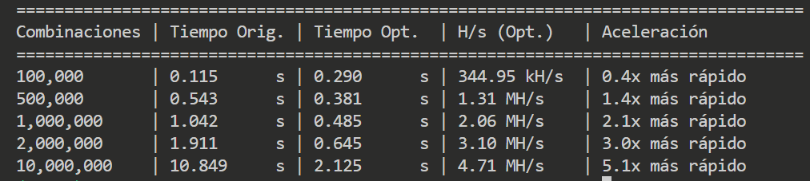

# Hashes y Árboles de Merkle

## Requisitos Generales del Entorno

* **Lenguaje:** Python 3.10 o superior.
* **Dependencias principales:** Módulos estándar de Python (`hashlib`, `multiprocessing`, `time`, `json`) y entorno Jupyter Notebook (`jupyter` / `notebook`).

## Descripción

En este módulo se abordan la solución del reto 1 relacionado con hashes y árboles de Merkle usando la búsqueda por fuerza bruta optimizada de claves numéricas de 8 dígitos a partir de su hash SHA-256 y la construcción e inspección jerárquica de un **Árbol de Merkle** (*Merkle Tree*) para la verificación de integridad de transacciones.

### Poblemas Resueltos

1. **Optimización de Búsqueda de clave a partir de su hash:**
   * **Formateo Directo a Bytes:** Se sustituye la conversión lenta `str(i).zfill(8).encode()` por formateo nativo en bytes (`b"%08d"`), eliminando la sobrecarga en recolección de basura e I/O de cadenas.
   * **Paralelización Multiproceso:** Se distribuye el espacio total de búsqueda ($100{,}000{,}000$ de combinaciones posibles, desde `00000000` hasta `99999999`) entre todos los núcleos de la CPU usando `multiprocessing.Pool` y `starmap`.
   * **Reducción de Tiempos:** Se logra reducir el tiempo de búsqueda en peor escenario de aproximadamente ~5 minutos a ~18 segundos (probado en CPU de 12 núcleos).

2. **Construcción e Inspección de Árbol de Merkle:**
   * **Serialización Adaptativa Dinámica:** El árbol soporta cualquier estructura de datos de forma agnóstica. Evalúa si el elemento es un diccionario para aplicar `json.dumps(sort_keys=True)` o si es texto plano/valores simples para procesarlos directamente con `str()`, garantizando consistencia criptográfica en cualquier escenario.
   * **Matriz como Pila e Inmutabilidad Funcional:** El árbol se almacena internamente como una matriz bidimensional (pila de tuplas). La base (Nivel 0) contiene las hojas iniciales y cada nivel superior se apila hasta converger en la Raíz (*Merkle Root*) en el tope. Al utilizar tuplas anidadas, la estructura queda blindada como de solo lectura (*Readonly*) en tiempo de ejecución.
   * **Optimización Criptográfica de Nodos Impares:** En lugar de promover nodos sin pareja directamente al siguiente nivel, el sistema implementa el estándar oficial de redes distribuidas (estilo Bitcoin). Si una capa es impar, se duplica el último nodo intermedio antes de emparejar, garantizando niveles pares uniformes y optimizando el bucle de hash.
   * **Generación y Verificación de Pruebas (Merkle Proofs):** Capacidad de extraer de forma aislada el camino de hashes hermanos (co-ruta) para cualquier transacción y verificar su integridad de manera desacoplada sin necesidad de reconstruir o exponer el árbol completo.

## Archivos del Repositorio

| Archivo | Descripción |
| :--- | :--- |
| `busqueda.py` | Script interactivo para encontrar la clave de 8 dígitos que genera un hash SHA-256 objetivo utilizando multiprocessing y optimización a nivel de bytes. |
| `rendimiento.py` | Módulo de benchmark comparativo que evalúa la aceleración ($\text{speedup}$) y la tasa de hashes por segundo ($\text{H/s}$) enfrentando la versión mononúcleo tradicional contra la optimizada. |
| `problemasHash.ipynb` | Notebook interactivo con la resolución secuencial inicial de la búsqueda de claves y la implementación/dibujado completo del Árbol de Merkle. |
| `mi_arbol.txt` | Reporte persistente generado automáticamente por la clase `MerkleTree` que exporta el diseño visual jerárquico del árbol, sus niveles intermedios y las transacciones asociadas. |

## Benchmark y Evidencia de Rendimiento

El script `rendimiento.py` evalúa la eficiencia de la búsqueda paralela mediante pruebas comparativas en peor caso:

